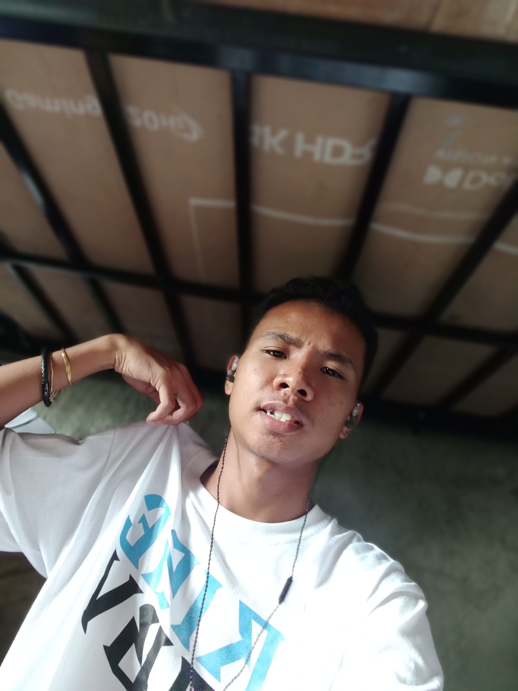
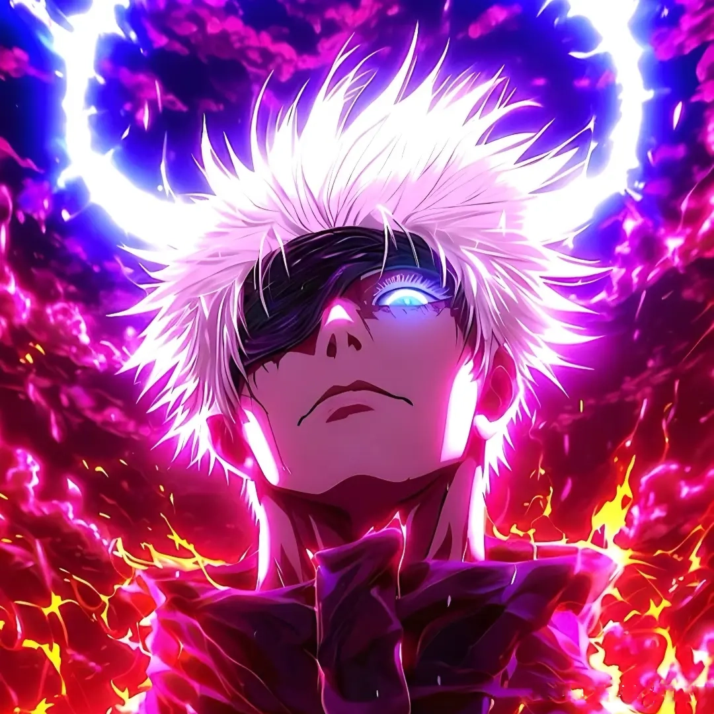
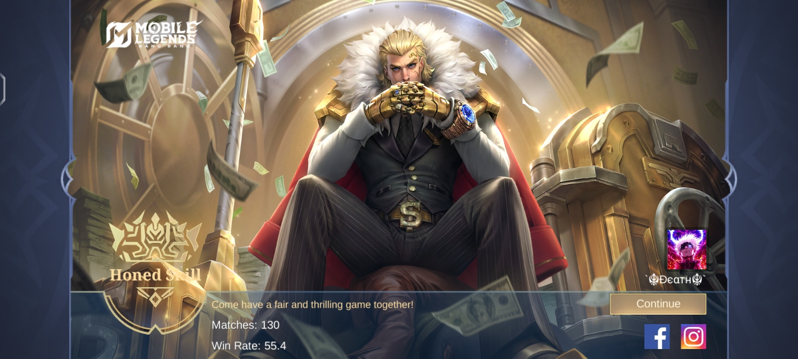

<html lang="en">
<head>
  <meta charset="utf-8" />
  <meta name="viewport" content="width=device-width, initial-scale=1" />
  <title>Ryle L. De Hitta | Portfolio</title>
  <meta name="description" content="Portfolio of Ryle L. De Hitta, BSIT-CPT-1 student and coding enthusiast." />

  <!-- Google Fonts -->
  <link href="https://fonts.googleapis.com/css2?family=Inter:wght@400;600;700&family=Space+Grotesk:wght@500;700&display=swap" rel="stylesheet">
  <!-- Font Awesome -->
  <link rel="stylesheet" href="https://cdnjs.cloudflare.com/ajax/libs/font-awesome/6.6.0/css/all.min.css" crossorigin="anonymous"/>

  <!-- Three.js + GSAP + ScrollTrigger (one set) -->
  
  
  

  
</head>
<body data-theme="dark">
  <!-- 3D background canvas (rotating geometric shapes) -->
  <canvas id="bg-3d" aria-hidden="true"></canvas>
  <!-- lightweight particle canvas (2D dots) -->
  <canvas id="particles" aria-hidden="true"></canvas>

  <!-- Logo reveal (will animate) -->
  
Ryle L. De Hitta

  <nav class="page" role="navigation" aria-label="Main navigation">
    
Ryle L. De Hitta

    

      <a class="nav-link" href="#home">Home</a>
      <a class="nav-link" href="#about">About</a>
      <a class="nav-link" href="#projects">Projects</a>
      <a class="nav-link" href="#skills">Skills</a>
      <a class="nav-link" href="#contact">Contact</a>
    

    

      <button class="theme-toggle" id="themeToggle" aria-label="Toggle theme"><i class="fa-solid fa-sun"></i></button>
      <button class="nav-toggle" id="navToggle" aria-label="Toggle menu" aria-expanded="false"><i class="fa-solid fa-bars"></i></button>
    

  </nav>

  <main class="page" id="home">
    <section class="hero" id="heroSection">
      

        <h1>Curious Mind. Code Crafter. Innovator.</h1>
        
Hey, I’m <strong>Ryle L. De Hitta</strong> — a BSIT-CPT-1 student and coding enthusiast passionate about building modern, AI-driven, and tech-inspired experiences.

        

          <a class="btn btn-primary" href="#projects"><i class="fa-solid fa-rocket"></i> Explore Projects</a>
          <a class="btn btn-outline" href="#contact"><i class="fa-solid fa-paper-plane"></i> Contact</a>
        

      

      

        

          
        

      

    </section>

    <section id="about">
      <h2>About Me</h2>
      

        

          <h3 style="color:var(--accent-2)">Who I Am</h3>
          
I'm <strong>Ryle L. De Hitta</strong>, a BSIT-CPT-1 student passionate about coding, design, and technology.

        

        

          <h3 style="color:var(--accent-2)">What Drives Me</h3>
          
I love challenges — whether it’s solving a tough bug or building something new. My goal: impactful, creative tech solutions.

        

      

    </section>

    <section id="projects">
      <h2>Projects</h2>
      

        <article class="proj-card tilt-safe">
          
          
<h3>AnimeInfo</h3>
AI-powered anime search & community curation — React, Node.js, AI

        </article>

        <article class="proj-card tilt-safe">
          
          
<h3>Logic & Switching Theory</h3>
OR-gates activity and visual demos.

        </article>

        <article class="proj-card tilt-safe">
          
          
<h3>MLBB Highlights</h3>
Mobile Legends gameplay highlights — editing & showcase.

        </article>
      

    </section>

    <section id="skills">
      <h2>Skills</h2>
      

        
HTML <strong>95%</strong>

        
CSS <strong>90%</strong>

        
JavaScript <strong>75%</strong>

        
Python <strong>70%</strong>

        
React <strong>60%</strong>

      

    </section>

    <section id="contact">
      <h2>Contact Me</h2>
      <form class="contact" id="contactForm" novalidate>
        <input name="name" type="text" placeholder="Your Name" required>
        <input name="email" type="email" placeholder="Your Email" required>
        <textarea name="message" rows="5" placeholder="Your Message" required></textarea>
        <button class="btn btn-primary" type="submit">Send Message</button>
        

      </form>
    </section>
  </main>

  <footer>© 2025 Ryle L. De Hitta. Crafted with ❤️ and creativity.</footer>

  <!-- Intro overlay (accessible, dismissible) -->
  

    

      <h1 style="font-family:'Space Grotesk',sans-serif;margin-bottom:8px;font-size:2.4rem">Welcome — Ryle L. De Hitta</h1>
      
Curious mind • Community builder • Code crafter

      

        <button id="enterBtn" class="btn btn-primary">Enter Portfolio</button>
        <button id="skipBtn" class="btn btn-outline">Skip</button>
      

    

  

  
  
